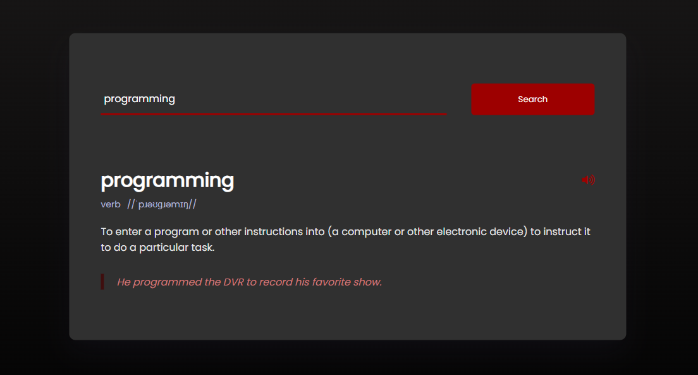
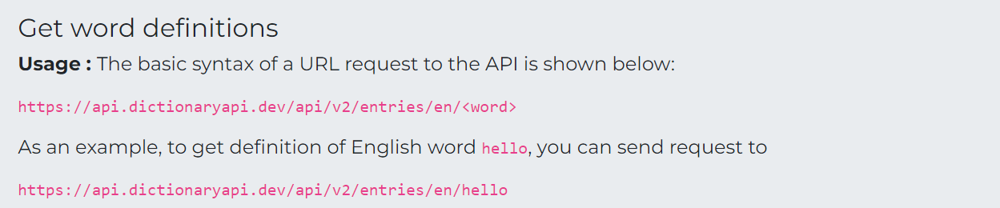

<h1 align="center">Dictionary WebApp</h1>

<p align="center">
  A simple and elegant web application that serves as a dictionary, allowing users to look up word definitions and pronunciations.
</p>

<p align="center">
  <a href="https://arindal1.github.io/Dictionary-WebApp/">View Demo</a> ·
  <a href="https://github.com/arindal1/Dictionary-WebApp/issues">Report Bug</a> ·
  <a href="https://github.com/arindal1/Dictionary-WebApp/issues">Request Feature</a>
</p>



## About the Project

Ever wanted a quick and easy way to look up word definitions and pronunciations? Look no further! The Dictionary WebApp is a user-friendly online tool that lets you explore the meanings, part of speech, and example usage of words in an elegant and efficient manner.

**Features at a Glance:**

📚 **Word Definitions:** Input any word you're curious about, and instantly get a comprehensive definition.

🗣️ **Pronunciation:** Wondering how a word sounds? With just a click, listen to the correct pronunciation.

🔍 **Part of Speech:** Get insights into the grammatical category of the word – whether it's a noun, verb, adjective, and more.

📝 **Example Usage:** Context is key! Discover how the word is used in sentences to deepen your understanding.


### Built With

- HTML
- CSS
- JavaScript
- [DictionaryAPI](https://dictionaryapi.dev/)

## Getting Started

To get a local copy up and running, follow these steps:

### Prerequisites

- A modern web browser

### Installation

1. Clone the repository
   ```sh
   git clone https://github.com/arindal1/Dictionary-WebApp.git
   ```
2. Open the `index.html` file in your preferred browser.

## Usage

1. Type a word in the search box.
2. Click the "Search" button.
3. The definition, part of speech, pronunciation, and example usage will be displayed.

## API

To power the word search functionality, we've integrated the Free Dictionary API. This API provides the information needed to enrich your vocabulary and language exploration.

📖 Learn more about the API: [Dictionary API](https://dictionaryapi.dev/)

- **API Endpoint:** `https://api.dictionaryapi.dev/api/v2/entries/en/`



## The Code

Let's break down the JavaScript code in the `script.js` file step by step:

1. **Defining Variables**:
   ```javascript
   const url = "https://api.dictionaryapi.dev/api/v2/entries/en/";
   const result = document.getElementById("result");
   const sound = document.getElementById("sound");
   const btn = document.getElementById("search-btn");
   ```

   - `url`: This variable holds the URL of the dictionary API, which is used to fetch word definitions.
   - `result`: This variable stores the DOM element with the ID "result", which is where the word definition and related information will be displayed.
   - `sound`: This variable represents an HTML `<audio>` element with the ID "sound", used to play the audio pronunciation of the word.
   - `btn`: This variable represents the search button element with the ID "search-btn".

2. **Adding Event Listener to Search Button**:
   ```javascript
   btn.addEventListener("click", () => {
       let inpWord = document.getElementById("inp-word").value;
       // Fetch the word data from the API based on the input word
       fetch(`${url}${inpWord}`)
           .then((response) => response.json())
           .then((data) => {
               // Handle the fetched data and update the result section
               // ...
           })
           .catch(() => {
               result.innerHTML = `<h3 class="error">Couldn't Find The Word</h3>`;
           });
   });
   ```

   - This code adds a click event listener to the search button. When the button is clicked, the following actions occur:
   - The value of the input field with the ID "inp-word" is retrieved and stored in the `inpWord` variable.
   - A `fetch` request is made to the dictionary API using the provided URL and the input word.
   - If the API request is successful, the response is parsed as JSON and passed to the first `.then()` function.
   - The fetched data is then processed and displayed in the result section.

3. **Updating the Result Section with Fetched Data**:
   ```javascript
   result.innerHTML = `
       <div class="word">
           <h3>${inpWord}</h3>
           <button onclick="playSound()">
               <i class="fas fa-volume-up"></i>
           </button>
       </div>
       <div class="details">
           <p>${data[0].meanings[0].partOfSpeech}</p>
           <p>/${data[0].phonetic}/</p>
       </div>
       <p class="word-meaning">
           ${data[0].meanings[0].definitions[0].definition}
       </p>
       <p class="word-example">
           ${data[0].meanings[0].definitions[0].example || ""}
       </p>`;
   sound.setAttribute("src", `https:${data[0].phonetics[0].audio}`);
   ```

   - This code updates the HTML content of the `result` element with the fetched data.
   - It creates various HTML elements to display the word, its part of speech, pronunciation, definition, and example usage.
   - The audio pronunciation source is set using the `setAttribute` method.

4. **playSound() Function**:
   ```javascript
   function playSound() {
       sound.play();
   }
   ```

   - This function plays the audio pronunciation of the word using the `.play()` method on the `sound` element.

5. **Error Handling**:
   ```javascript
   .catch(() => {
       result.innerHTML = `<h3 class="error">Couldn't Find The Word</h3>`;
   });
   ```

   - If the API request fails (e.g., the word isn't found), an error message is displayed in the result section.

Overall, the JavaScript code fetches data from the API, processes it, and updates the HTML content of the result section with information about the searched word, including its definition, part of speech, and pronunciation.

## Roadmap

See the [open issues](https://github.com/arindal1/Dictionary-WebApp/issues) for a list of proposed features (and known issues).

## Contributing

Contributions are what make the open-source community an amazing place to learn, inspire, and create. Any contributions you make are **greatly appreciated**.

1. Fork the Project
2. Create your Feature Branch (`git checkout -b feature/AmazingFeature`)
3. Commit your Changes (`git commit -m 'Add some AmazingFeature'`)
4. Push to the Branch (`git push origin feature/AmazingFeature`)
5. Open a Pull Request

## Contact

If you have any questions, suggestions, or just want to connect, feel free to reach out:

- GitHub: [arindal1](https://github.com/arindal1)
- LinkedIn: [arindalchar](https://www.linkedin.com/in/arindalchar/)

## Resources

- DictionaryAPI provided by [Free Dictionary](https://dictionaryapi.dev/).
- Fonts from the project: [Font Awesome](https://fontawesome.com/), [Google Fonts](https://fonts.google.com/)

## Project link
[Dictionary WebApp](https://github.com/arindal1/Dictionary-WebApp)

## Note

This is a personal project created for educational and demonstrative purposes. I made this project just for fun and learn more about JavaScript and APIs in the process, and record my progress in development.

### Happy learning and programming! ⛄
